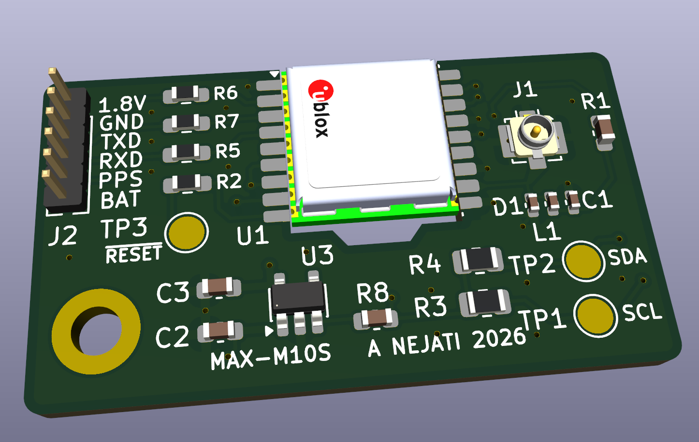

KiCAD schematic and pcb for a low profile GNSS module carrier (<3 mm thickness) using ublox MAX-M10S module and interfacing to 1.8V UART. This is for a project for adding gnss to a Kobo Clara Colour.

